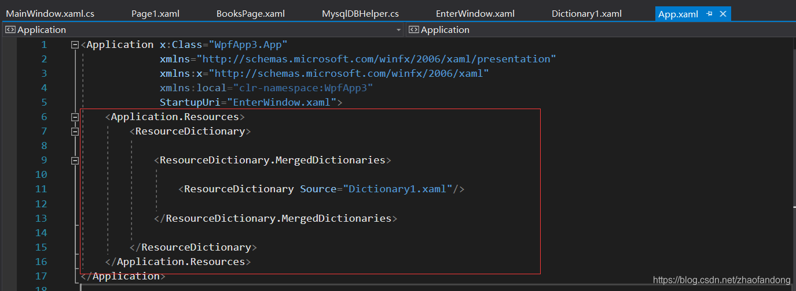

## 2020年に作成した簡単なプロジェクト、就職活動のため振り返ってみます

このプロジェクトはC# WPFで作成し、データベースにはMySQLを使用しています。MVCフレームワークを使用せず、シンプルなクリックベースの構造を採用しています。
簡単なプロジェクトを完成させるには、明確な目標を持ち、行動することが重要です。
ユーザーの立場に立って考え、基本に基づいて調整を行います。

インターフェース + 機能 + データベース
これだけで簡単なプロジェクトを完成させることができます。

その後、読み込みの最適化、スレッドの制御など、さらなる改善を行います。

## 効果


## リソースディクショナリの内容

```xaml
<ResourceDictionary xmlns="http://schemas.microsoft.com/winfx/2006/xaml/presentation"
                    xmlns:x="http://schemas.microsoft.com/winfx/2006/xaml"
                    xmlns:local="clr-namespace:WpfApp3">
    <!-- Same XAML code as original -->
</ResourceDictionary>
```

リソースディクショナリには、テキストボックスやボタンなどのコントロールを変更するためのスタイルが含まれています。私が書いた内容が主な焦点です。参考までに。

## リソースディクショナリの参照方法

`App.xaml`ファイルを見つけて、以下のように挿入します。まず、私のリソースディクショナリの名前は`Dictionary1.xaml`です：



赤枠内の内容を入力するだけです。sourceの内容にはリソースディクショナリの名前を入力します。これで、グローバルに使用できるようになります。

次のセクションでは、異なるログイン方法に対する権限の設定方法について説明します（非常にシンプルな、初心者向けの方法です）。 